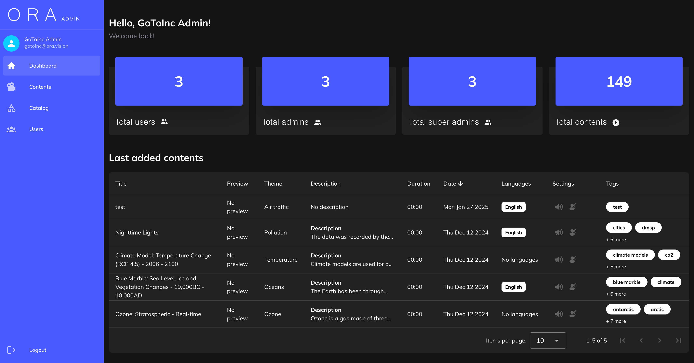

<h1 align="center">ORA admin panel</h1>


## Project Objective
The goal of the project is to develop an Admin Panel. It provides administrators with an interface to manage users, categories, and video contents, including multilingual support.

## Overview
Admin Panel is built with Vue.js and TypeScript, using Vuetify for a modern and responsive UI.

### Tech stack:
- Vue 3 (Composition API)
- TypeScript 
- Vuetify (UI framework)
- Vite (Development & build tool)
- Axios (API communication)

### Features
- **User management**: create, edit, and delete users with different roles.
- **Category Management**: handle up to three levels of categories for better content organization.
- **Video Content Management**: upload and manage videos with multilingual support
- **Separate Media Uploads**: upload multiple audio and video files separately for different languages.
- **Modern UI with Vuetify**: ensures a responsive and user-friendly experience.

## Requirements:
Project requires Node.js version 18+. Feel free to install it via [nvm](https://github.com/nvm-sh/nvm) or [asdf](https://asdf-vm.com) with [Node.js plugin](https://asdf-vm.com/guide/getting-started.html#_4-install-a-plugin).
Optional: [pnpm](https://pnpm.io/).

## Getting started:

### Install dependencies:

```sh
# npm
$ npm i

# pnpm
$ pnpm install
```

### Prepare local environment:

Prepare `husky` to automatically lint your commit messages, code, and run tests upon committing or pushing

```sh
$ npm run prepare
```

### Start Vite dev server:

```sh
$ npm run dev
```

### Build project:

```sh
$ npm run build
```

### Preview the build:

```sh
$ npm run preview
```

### Analyze your code with ESLint:

```sh
$ npm run lint
```

### Type checking via Vue Typescript Services:

```sh
$ npm run tsc
```

